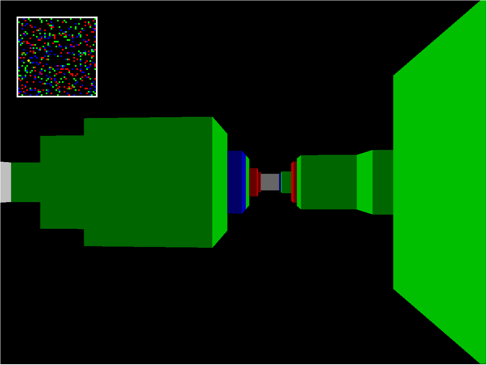
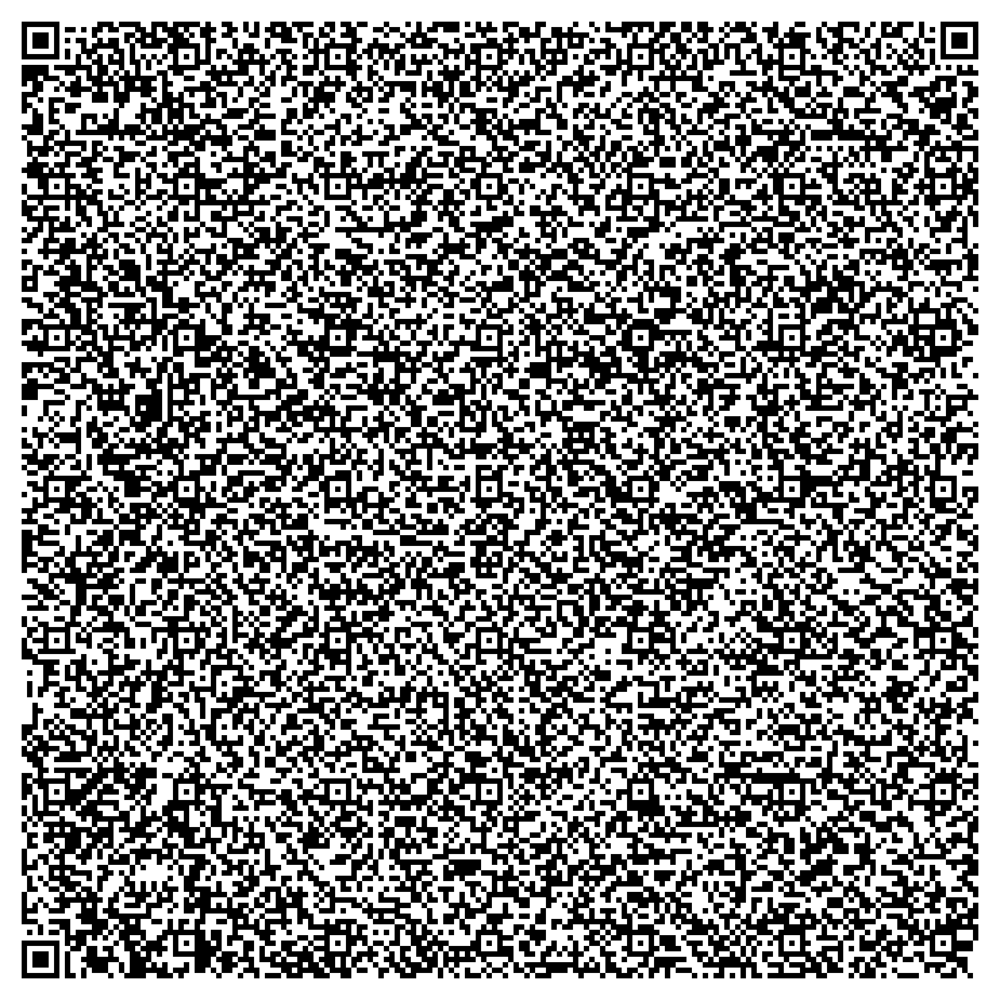

# QRRaycast

QRRaycast a simple web raycaster simulator built in html/js/css fitting in a humble QR code. It features infinite generated mazes with functional movement and minimap. Find the mysterious PINK CUBE to advance to the larger map, forever and beyond.

# Simulation

# QR Code
